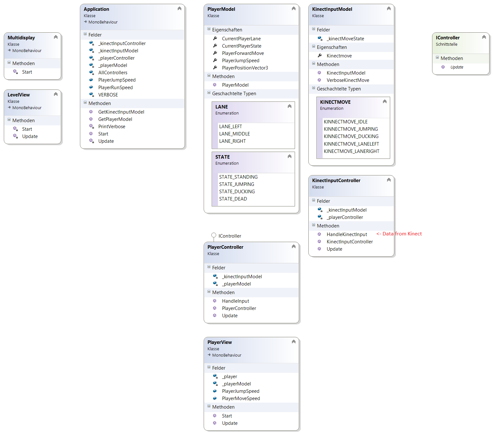

# HumanMachineRunner
Ein Projekt der Hochschule Furtwangen im Rahmen der Veranstaltung Mensch-Maschine-Interaktion. Das Ziel ist es, eine Anwendung zu entwickeln, welche mithilfe von Gestenerkennung oder anderen Sensoren gesteuert werden kann. Es wurde sich dabei auf die Kinect V2 geeinigt, auf Basis derer ein Spiel entwickelt werden soll, welches dem Spielprinzip typischer "Endless-Runner-Games" ähnelt.

Team:
- Sarah B.
- Moritz R.
- Robert D.

# Architektur
##MVC

Als Konzept kommt Model-View-Controller zum Einsatz. D.h. in den Model Klassen stehen die Attribute, die für den jeweiligen Typen gebraucht werden. Das ist z.B. beim Player der "jumpSpeed". Diese Attribute sind mit Geta/Seta ausgestattet.
Jeder dieser Model Klassen besitzt einen dazugehörigen Controller. Dieser steuert die Attribute der Klasse Model und ist zuständig, dass sich während des laufenden Spiels die Werte in der Model Klasse des Objekts ändern.
So ist jeder Controller mit einer Methode Update() ausgestattet, welche von der "Über"-Klasse Application jeden Frame aufgerufen wird. Damit ist es möglich in dieser Methode Werte anzupassen.
Die dazugehörige View Klasse ist nun dafür zuständig, Werte der Modelklasse nach außen hin zur Verfügung zu stellen, jedoch nur solche, die für den Spielstart unerlässlich sind. Alle anderen Werte werden von der Controller Klasse geändert.
Ebenso greift die View Klasse auf die Attribute der Model Klasse zu, um z.B. die Spielerposition abzugreifen und diese nach außen hin sichtbar zu machen.

<strong>Das Klassendiagramm</strong>

Dieser Aufbau beinhaltet nun einen Player mit MVC und eine Klasse Kinect mit MC.
Die Klasse Kinect besitzt eine Enumeration, welche die verschiedenen Eingabemöglichkeiten in unserem Spiel abbildet.
Durch den Einsatz des Datentyps Enum kann immer nur eine Geste erkannt und ausgeführt werden. Dies entspricht vom Aufbau her einem endlichen Automaten (vgl. Techn. Informatik).

Der Status der Kinekt Eingabe wird schließlich an den Controller des Spielers weitergegeben. Das Spieler-"Model" besitzt ebenfalls eine sog. State-Machine und kann nur eine Handlung gleichzeitig ausführen.
Die Handlung, welche ausgeführt werden soll, wird vom PlayerController.HandleInput() gesetzt.

Was auf diesem Diagramm fehlt, ist die Dateneingabe der Kinect von außerhalb. Diese muss noch abgegriffen und eingepflegt werden.
Der Vorteil dieses Systems ist die Möglichkeit jegliche Eingabemöglichkeit "anzuflanschen" ohne das etwas umgeschrieben werden muss.

Die Methode KinectInputController.HandleKinectInput(string kinectInput) nimmt Strings entgegen und steuert das komplette Spiel.
Woher diese kommen - von einem Tastaturcontroller, der einen Befehl triggert, einer Maus oder einer Kinect ist irrelevant.

---

Was nun noch implementiert werden muss ist Folgendes (mit Angabe der Personen):
<li>Daten der Kinect abgreifen und je nach erkannter Geste einen String an die Methode HandleKinectInput weitergeben - <strong>Robert?</strong></li>
<li>Gewünschte Funktionialitäten und Daten im Controller und im Model einbauen und für den View zur Verfügung stellen - <strong>Moritz</strong></li>
<li>In den View Klassen die Werte der Model Klassen abgreifen und diese in den Assets einpflegen - <strong>Sarah?</strong></li>
<li>Assets erstellen, Level bauen - <strong>Robert, Renee?</strong></li>